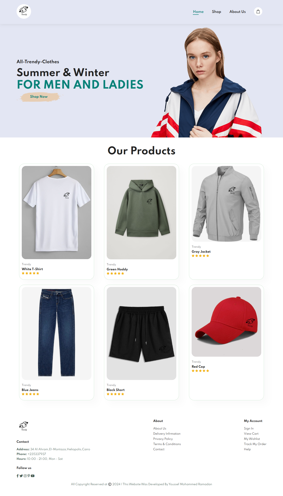

# 🛍️ Trendy Store

A simple responsive clothing store website built with HTML, CSS, and JavaScript. This project demonstrates a basic layout for an online store with interactive features.

## 📁 Technologies Used
- HTML5
- CSS3
- JavaScript

## 📦 Features
- Responsive design
- Product cards
- Add to cart button (non-functional for demo)

## 🌐 Live Demo
[View on GitHub Pages]((https://youssefmohamed18.github.io/Trendy-Store/))

## 🔍 Preview

---

## 👨‍💻 Developed by:
[Youssef Mohamed](https://www.linkedin.com/in/youssef-mohamed00/)

